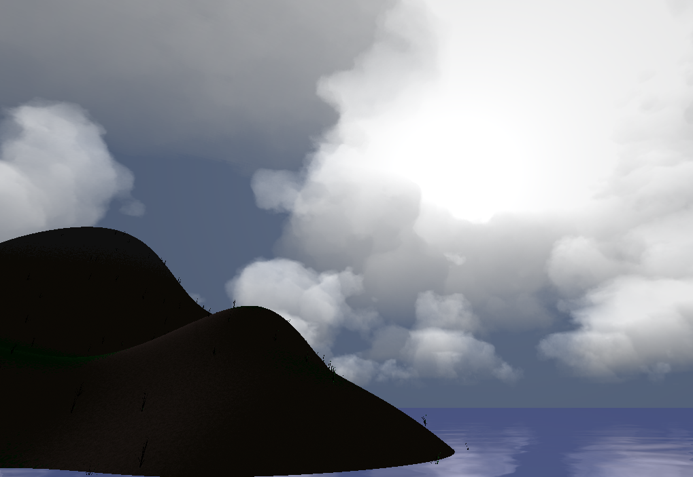

# irrSky
realtime volumetric clouds based on irrlicht  
基于irrlicht的体积云  
此项目复制粘贴自[Smoothly](https://github.com/SingingRivulet/Smoothly)，部分头文件、着色器的路径可能有错，如有报错，请自行修改  
## 效果
  
## 使用方法
        smoothly::cloud C(driver,scene);
然后在每一帧调用C.renderSky()即可  
### 设置参数
在运行时，你可以设置下面的参数来控制云的形态、分布  
        irr::f32 cloudThre, // 云量，越大云越少
                 cloudy,    // 阴天，设置天空背景颜色，越大越接近阴天
                 lightness; // 亮度，用于模拟夜晚
这些参数用于设置发光天体（太阳或者月亮）  
        irr::core::vector3df astronomical,//发光天体位置
                             astrLight,   //天体亮度
                             astrColor;   //天体颜色
        float                astrAtomScat,//大气层散射
                             astrTheta;   //天体在视野中夹角（即天体大小）
## 硬件要求
intel i5的核显即可。经过我的优化，在核显上能达到40fps+  
